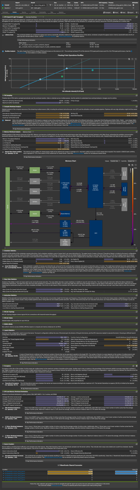

# GEMM Optimization: Shared-Memory Block Tiling

This document explains the optimization of a CUDA General Matrix Multiplication (GEMM) kernel from a straightforward **naive** implementation to a **block-tiled** implementation. The goal is to reduce redundant global-memory traffic, raise arithmetic intensity, and keep the GPU's floating-point pipelines busier.

## Result at a Glance

On an NVIDIA GeForce RTX 2060, the block-tiled kernel completed the profiled workload in **808.93 us**, compared with **5.99 ms** for the naive kernel.

| Kernel | Time | GPU cycles | Relative result |
|---|---:|---:|---:|
| `naive_gemm` | 5.99 ms | 7,282,327 | baseline |
| `block_tiling_gemm` | 808.93 us | 975,308 | **7.4x faster** |

The optimized kernel reduces execution time by **86.5%**. The two measurements ran at nearly the same GPU clock (1.20 GHz vs. 1.21 GHz), so the improvement is attributable to the kernel design rather than a frequency difference.

## Nsight Compute Profile



The report above compares `block_tiling_gemm` (blue/current) against `naive_gemm` (green/baseline). It shows the most important change in this optimization: the kernel exchanges excessive off-chip memory traffic for useful on-chip reuse and floating-point work.

## Why Naive GEMM Leaves Performance on the Table

For a matrix product

\[
C = A \times B, \qquad C_{ij} = \sum_k A_{ik}B_{kj},
\]

a naive CUDA implementation commonly assigns one output element `C[i][j]` to one thread. Each thread walks the full `K` dimension and repeatedly loads `A[i][k]` and `B[k][j]` from global memory.

This is correct, but neighboring threads need many of the same values:

- Threads computing different columns in a row reuse elements of `A`.
- Threads computing different rows in a column reuse elements of `B`.
- The naive kernel does not explicitly coordinate that reuse. Caches may help, but their behavior is not a substitute for deliberate reuse in shared memory.

The result is a kernel that spends too much time waiting for data instead of issuing fused multiply-add (FMA) instructions.

## The Block-Tiling Strategy

The optimized kernel partitions the output matrix into tiles. A thread block computes one output tile, and repeatedly processes a matching tile of `A` and `B` along the reduction dimension.

For each reduction tile:

1. Threads cooperatively load a tile of `A` and a tile of `B` from global memory into shared memory.
2. The block synchronizes so all tile data is available.
3. Each thread performs many FMA operations using the shared tiles, while retaining partial sums in registers.
4. The block synchronizes before shared-memory storage is reused for the next reduction tile.
5. After all reduction tiles have been processed, the accumulated values are written to `C` once.

Conceptually, a global-memory load becomes useful to many threads and many FMA operations. This changes the fundamental cost balance of GEMM: rather than fetching the same operands over and over, the kernel loads them once per tile and reuses them on chip.

```text
Naive GEMM
  thread(i, j): repeatedly load A[i, k] and B[k, j] from global memory

Block-tiled GEMM
  block(I, J): load A[I, K] and B[K, J] tiles once into shared memory
  threads:     reuse those tiles for many partial C[I, J] products
```

## What the Profile Confirms

### 1. Much less pressure on device memory

The profile reports only **1.94% DRAM throughput** for the tiled kernel, a **86.24% reduction** relative to the naive version. It also reports just **163.84 KB** of the shown global-memory-to-kernel traffic, a **99.76% reduction** in that counter.

This does not mean GEMM no longer needs global memory. Instead, it means most operands are fetched once per tile and then reused from shared memory/registers, rather than repeatedly refetched for individual output elements.

### 2. Shared memory is actively doing the reuse work

The Memory Chart shows **8.52M shared-memory instructions** and **8.39M shared-memory requests** for the tiled kernel. These accesses are expected: they are the deliberate staging and reuse of `A` and `B` tiles.

Shared-memory traffic is inexpensive compared with repeated DRAM accesses, especially when it supports many FMAs per load.

### 3. Arithmetic intensity rises sharply

The Floating Point Operations Roofline moves from approximately **8 FLOP/byte** for the naive kernel to approximately **420 FLOP/byte** for the block-tiled kernel. In other words, the tiled kernel performs far more computation for each byte transferred from memory.

Its measured performance rises from roughly **0.3 TFLOP/s** to more than **2 TFLOP/s** in the plotted roofline. The exact reading is visual, but the direction is unambiguous: block tiling moves GEMM away from a memory-dominated regime and closer to the GPU's compute roof.

### 4. The floating-point pipeline is used more effectively

The optimized kernel reaches **57.83% SM compute throughput** and the profile identifies the FMA pipeline as the dominant pipeline. The FMA utilization charts show a clear advantage for the tiled kernel over the naive baseline.

That is the intended effect of data reuse: once operands are nearby, the SM can spend more cycles executing FMAs and fewer cycles stalled on memory operations.

### 5. The launch does more useful work per block

The profiled tiled launch uses `(4, 4, 1) x (256, 1, 1)`, while the naive launch uses `(64, 64, 1) x (16, 16, 1)`. Both use 256 threads per block, but the tiled kernel launches far fewer blocks—**16 instead of 4,096**—because each block computes a larger output region.

This arrangement increases reuse within a block and lets each thread/block amortize indexing, loading, and synchronization costs over more arithmetic work.

## Remaining Bottlenecks and Next Steps

Block tiling is a major improvement, but the profile also shows room for another optimization pass.

| Observation from the profile | Interpretation | Possible direction |
|---|---|---|
| 50% achieved occupancy | Latency-hiding capacity is constrained | Balance register use, shared-memory footprint, and block shape |
| 0.68 eligible warps per scheduler on average | Schedulers often lack a ready warp | Increase useful parallelism or reduce dependency/latency chains |
| 50% tail effect | 64 blocks do not fill the final execution wave on 30 SMs | Adjust grid decomposition or workload size when applicable |
| 59.49% compute throughput | The kernel is no longer primarily DRAM-bound, but it is not compute-saturated | Consider vectorized/coalesced loads, warp-level tiling, and architecture-specific tuning |

Practical next experiments include:

- Let each thread accumulate a small register tile of output values, while monitoring register growth.
- Use vectorized, aligned loads when matrix layout and dimensions allow it.
- Check global-load coalescing and shared-memory bank conflicts in the detailed profiler sections.
- Explore warp-level tiling and, when numerical format and hardware permit, Tensor Core paths.

## Takeaway

The optimized kernel wins because it changes the unit of reuse from an individual thread to an entire thread block:

> **Load input tiles once from global memory, reuse them many times in shared memory and registers, then write each output value once.**

The Nsight Compute evidence supports that story: global-memory demand drops sharply, arithmetic intensity rises by roughly an order of magnitude, FMA utilization improves, and the final kernel is **7.4x faster** than the naive implementation.
